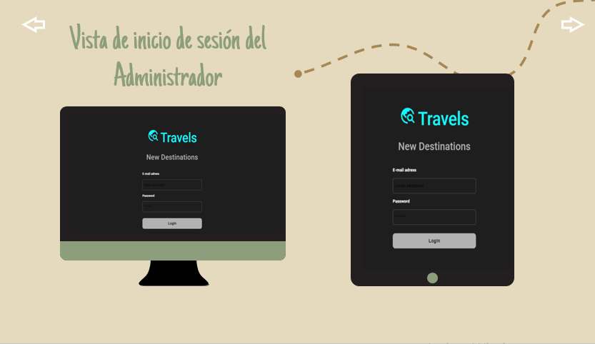
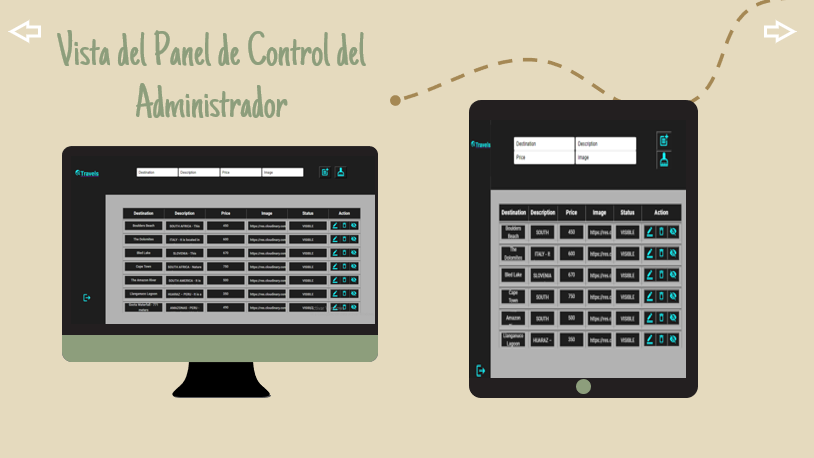
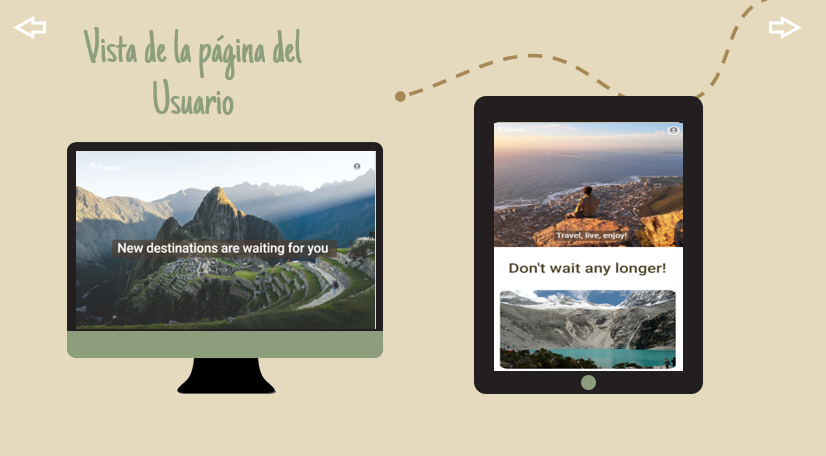
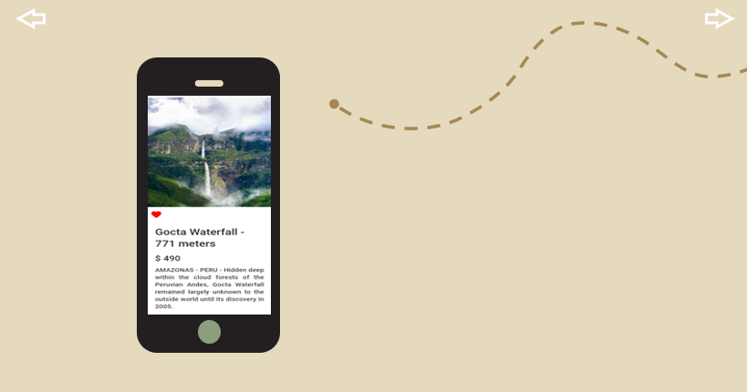

# Travels - New Destinations
It is a responsive web application designed for a travel agency that aims to attract adventurous travelers and promote their tour packages.
The target audience is adults aged 20 to 40 who want to explore the world.
The market's need is to find a website with attractive destinations, travel advice, and competitive prices.

# Interface Design
It adapts to different screen sizes, ensuring an optimal user experience on various mobile devices and desktops.
### Final project images for Desktop and Tablet.
#### Administrator view:
- Login
    
 
- Dashboard
   

 
### Final project images for Desktop, Tablet and Mobile.
##### User view:
- Home
  

  
 

# Description of the administrator's dashboard:
- It has a form that allow adding posts with information about the tour packages: title, description, price and image (images were uploaded to Cloudinary).
- It allows listing destinations, editing, deleting, and disabling posts.
- Data persistence: all the data is stored in Firebase.
# Description of the user view:
- It allows giving Likes to the posts.

